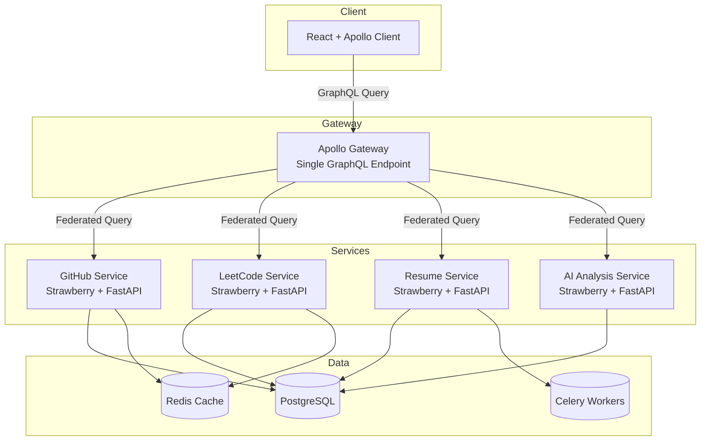

<p align="center">
  
</p>

# EngineerGenome

**GraphQL Federation Based Developer Intelligence Platform**

EngineerGenome aggregates your GitHub activity, LeetCode progress, resume data, and AI-generated insights into a single developer profile, exposed through one unified GraphQL API.

This project is built as a **learning vehicle** for GraphQL Federation. Every phase has a matching lesson document and a personal reflection file in `learning-journal/`. The goal is not just to ship code but to be able to talk confidently about every design decision in an interview.

---

## What EngineerGenome Does

A developer connects their GitHub and LeetCode accounts, uploads a resume, and gets back a scored profile with skill gap analysis and career recommendations. Instead of building separate REST endpoints per data source, every feature is exposed through a single GraphQL API composed from independent microservices.

---

## Architecture



The frontend talks to exactly one endpoint. It never knows which service owns which data.

---

## Phase Roadmap

| Phase | Topic | Status |
|-------|-------|--------|
| 1 | GraphQL Fundamentals (FastAPI + Strawberry) | In Progress |
| 2 | GitHub Microservice | Planned |
| 3 | LeetCode Microservice | Planned |
| 4 | Resume Intelligence Service | Planned |
| 5 | AI Analysis Service | Planned |
| 6 | GraphQL Federation + Apollo Gateway | Planned |
| 7 | Subscriptions (Live Activity Feed) | Planned |
| 8 | Auth, Caching, DataLoader, Pagination | Planned |

---

## Learning Journal

Every phase has a personal reflection file in `learning-journal/`.

```
learning-journal/
  README.md          <- How to use the journal
  phase-01-notes.md  <- Your notes for Phase 1
  phase-02-notes.md  <- Your notes for Phase 2
  ...
```

These files are not auto-generated. You write them in your own words as you go. The value during interviews is enormous: you can point to specific commits and explain exactly what you were learning when you wrote that code.

---

## Tech Stack

| Layer | Technology | Why |
|-------|-----------|-----|
| API Gateway | Apollo Gateway | Industry standard for GraphQL Federation |
| Backend Services | FastAPI + Strawberry | Python-native GraphQL with clean type hints |
| Database | PostgreSQL | Reliable relational store, one per service |
| Cache | Redis | Query result caching, session storage |
| Queue | Celery | Background jobs for resume parsing and AI |
| Frontend | React + Apollo Client | Best-in-class GraphQL client |
| Styling | Tailwind CSS | Utility-first, fast prototyping |
| Containers | Docker + Docker Compose | Reproducible local environment |

---

## Getting Started (Phase 1)

Phase 1 is a self-contained learning playground. No Docker required yet.

```bash
cd playground
python -m venv venv
source venv/bin/activate   # Windows: venv\Scripts\activate
pip install -r requirements.txt
uvicorn app.main:app --reload
```

Open [http://localhost:8000/graphql](http://localhost:8000/graphql) for the interactive GraphiQL playground.

Read [docs/02-graphql-fundamentals.md](docs/02-graphql-fundamentals.md) before writing any code.

---

## Documentation

| File | Topic |
|------|-------|
| [01-project-overview.md](docs/01-project-overview.md) | Full architecture walkthrough |
| [02-graphql-fundamentals.md](docs/02-graphql-fundamentals.md) | Schema, types, queries, mutations, resolvers |
| 03 through 16 | Added per phase |

---

## Project Philosophy

- Explanation before implementation, always
- No magic. Every line has a reason.
- Interview-ready understanding, not just working code
- Minimal, production-quality code structure from day one
