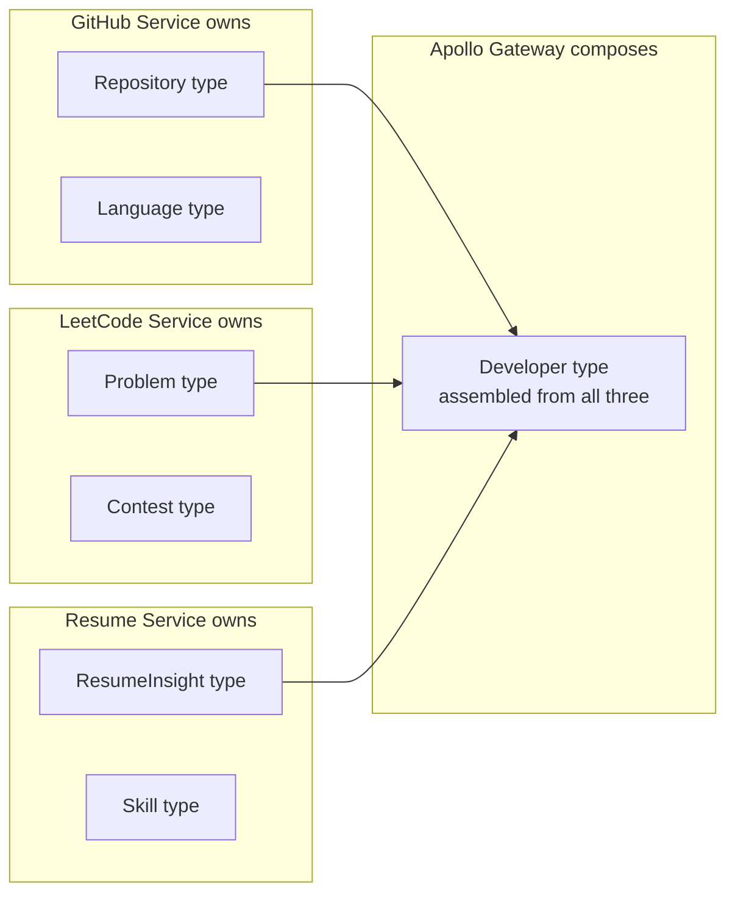
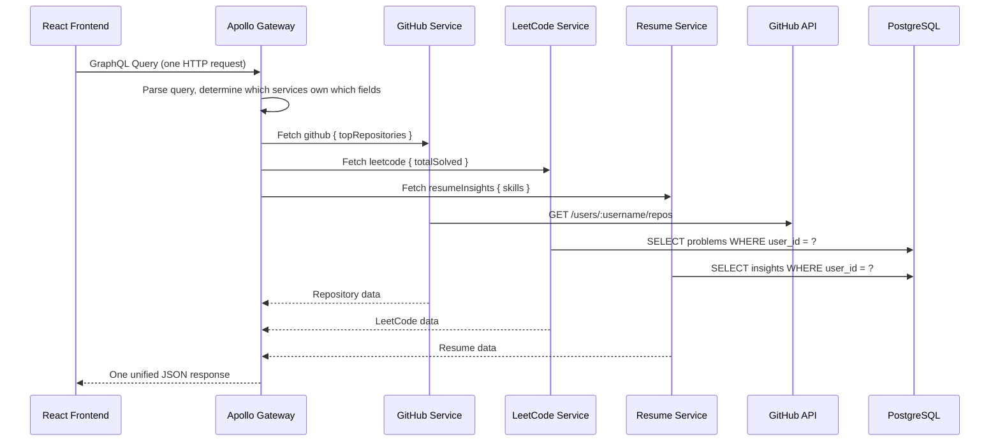
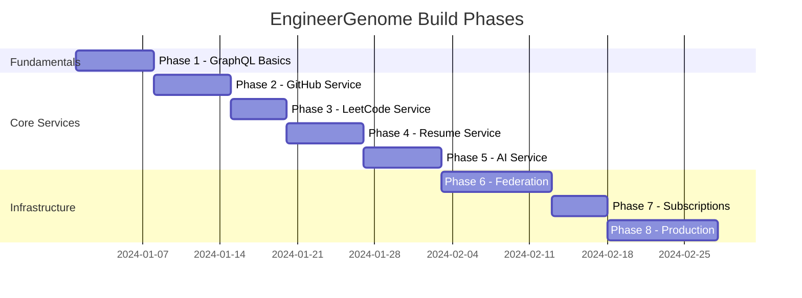

# 01 - Project Overview

## What Are We Building?

EngineerGenome is a developer intelligence platform. Give it your GitHub username, LeetCode handle, and resume PDF, and it builds a complete picture of who you are as an engineer: what you know, what you have shipped, and where you have gaps compared to the roles you want.

The product is the excuse. The real goal is to learn GraphQL Federation by building something genuinely complex enough to justify it.

---

## The Core Problem We Are Solving

Imagine your frontend needs to render a developer profile page showing:

- Name and bio from your internal user table
- Top repositories and most-used languages from GitHub
- LeetCode problem counts and contest rating
- AI-extracted skills from your resume

With REST, you have a few options. None of them are great.

**Option A: One Giant Endpoint**

The backend creates `/api/profile/:username` and fetches everything inside it. Now one endpoint owns four data sources. It becomes slow, hard to test, and breaks when any one source fails.

**Option B: Multiple Endpoints**

The frontend calls four endpoints and stitches the data together itself. Now the frontend owns the aggregation logic. It makes four round trips. Any change in data shape from the backend breaks the frontend.

**Option C: BFF (Backend for Frontend)**

You build a dedicated service that aggregates for the frontend. This works, but you've essentially built a custom data layer for one client. Add a mobile app and you build another BFF.

GraphQL solves this differently. The client declares exactly what it needs in one request:

```graphql
query GetDeveloperProfile {
  developer(username: "sumit") {
    name
    bio
    github {
      topRepositories(limit: 5) {
        name
        stars
        primaryLanguage
      }
    }
    leetcode {
      totalSolved
      contestRating
    }
    resumeInsights {
      skills
      yearsOfExperience
    }
  }
}
```

One request. One response. Exactly the fields asked for. The gateway figures out which services own which data and assembles the response.

---

## Why GraphQL Federation Specifically?

Federation is the answer to a specific problem: how do multiple teams own parts of the same GraphQL schema without stepping on each other?

Without federation, you need one central schema file that everyone edits. That becomes a coordination bottleneck. The GitHub team and the LeetCode team both need to touch the same schema definition.

With federation, each service owns its own schema. Each service can be deployed independently. The gateway stitches them together at runtime into one unified schema.

Think of it like this. A company has separate departments: HR, Finance, and Engineering. Each department maintains its own records. A central directory service combines them so that when you look up an employee, you see their payroll info from Finance and their equipment list from IT, even though those records live in separate systems.



The `Developer` type is an entity that each service can extend. GitHub extends it with `github` data. LeetCode extends it with `leetcode` data. The gateway composes the final type automatically.

---

## Architecture Deep Dive

### Request Flow



The gateway fans out requests to services in parallel when possible. Total response time is `max(service_times)` not `sum(service_times)`.

### Service Boundaries

Each service is a separate Python process, a separate PostgreSQL database, and a separate Docker container.

```
services/
  gateway/          Node.js Apollo Gateway
  github-service/   FastAPI + Strawberry + PostgreSQL
  leetcode-service/ FastAPI + Strawberry + PostgreSQL
  resume-service/   FastAPI + Strawberry + PostgreSQL + Celery
  ai-service/       FastAPI + Strawberry + Celery
```

This is the phase structure we will build toward. Phase 1 does none of this. Phase 1 is a single service with no federation, so you can learn the fundamentals without the complexity of multiple processes.

---

## Tech Stack Decisions

### Why FastAPI?

You already know it. FastAPI is async-first, has excellent type hint support, generates OpenAPI docs automatically, and integrates cleanly with Strawberry. There is no learning curve here. That lets us focus on GraphQL concepts.

### Why Strawberry?

Strawberry is a code-first GraphQL library for Python. You define your schema using Python classes and decorators. Strawberry generates the SDL (Schema Definition Language) for you.

The alternative in Python is Graphene. Strawberry is newer, has better type hint support, and its design maps more naturally to how Python developers already think.

Official docs: https://strawberry.rocks/docs

### Why Apollo Gateway?

Apollo Gateway is the most widely deployed GraphQL gateway. It is the reference implementation for Federation v1 and v2. Understanding it is directly marketable in interviews.

Official docs: https://www.apollographql.com/docs/gateway

### Why PostgreSQL per service?

Each microservice owning its own database is the correct pattern in distributed systems. Services that share a database are tightly coupled at the data layer, which defeats the purpose of microservices. When the GitHub service schema changes, it should not affect the LeetCode service database.

---

## Phase Overview



Each phase builds on the last. Phase 1 produces standalone knowledge. Phase 6 is where everything comes together.

---

## What You Will Be Able to Say After This Project

In an interview, you will be able to answer:

- "Walk me through a GraphQL Federation architecture you have built."
- "How does the Apollo Gateway handle query planning across services?"
- "What is the N+1 problem and how did you solve it with DataLoader?"
- "How does cursor-based pagination work in GraphQL?"
- "How do you handle authentication in a federated GraphQL system?"

These are real questions from real backend interviews. Every phase is designed to let you answer at least one of them from direct experience.

---

## What You Learned

- Why federation exists and what problem it solves
- How the gateway composes responses from multiple services
- Why each service needs its own database
- The difference between REST BFF patterns and GraphQL Federation

## Exercises

1. Draw the data flow diagram for a query that needs data from all four services. Which part does the gateway handle? Which part does each service handle?

2. Write out in plain English what the `Developer` type might look like if every service extends it. What fields would GitHub own? What fields would LeetCode own?

3. Research what happens when one service is down. Does the entire query fail? Can the gateway return partial results? Look at: https://www.apollographql.com/docs/federation/error-handling

## Further Reading

- GraphQL official site: https://graphql.org
- Apollo Federation concepts: https://www.apollographql.com/docs/federation
- Strawberry Federation docs: https://strawberry.rocks/docs/guides/federation
