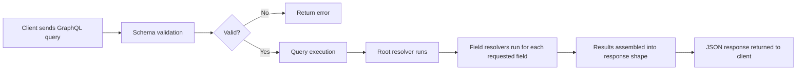

# 02 - GraphQL Fundamentals

This document covers everything you need to understand before writing Phase 1 code. Read it once before you touch any files. Then read it again after you have the playground running and can see the concepts live.

---

## The Problem That GraphQL Solves

Before learning GraphQL, understand why it was invented.

Facebook built it in 2012 because their mobile app was hammering their servers with too many requests, and their existing REST APIs were returning far more data than mobile clients needed.

These two problems have names.

**Over-fetching**: The API returns more data than the client needs.

You need to show a user's name and avatar in a navbar. You call `GET /api/users/123`. The server returns a 40-field object: name, email, phone, address, billing info, preferences, account history. You use 2 fields. The other 38 travel across the network for nothing.

**Under-fetching**: One request is not enough. The client needs to make multiple requests to gather everything needed for one screen.

You are building a developer profile page. It needs:
- User data from `/api/users/123`
- Repositories from `/api/users/123/repos`
- Languages from `/api/repos/456/languages`
- LeetCode stats from `/api/leetcode/123`

Four requests. Four round trips. Each one adds latency.

GraphQL's answer is simple: **let the client say exactly what it needs, and the server returns exactly that**.

---

## What GraphQL Actually Is

GraphQL is three things at once:

1. **A query language** - a syntax that clients use to describe what data they want
2. **A type system** - a way to define the shape of all data your API can return
3. **A runtime** - the server-side machinery that receives a query, validates it against the type system, and executes it

Everything revolves around the **schema**. The schema is a contract between client and server that says: here are all the types that exist in this system, here are the fields on each type, and here are the operations you can perform.

---

## The Schema Definition Language (SDL)

GraphQL has its own language for writing schemas. It is called SDL. You will see it in documentation everywhere.

Here is a simple schema:

```graphql
type Developer {
  id: ID!
  username: String!
  name: String!
  email: String!
  bio: String
  yearsOfExperience: Int!
  skills: [String!]!
}

type Query {
  developers: [Developer!]!
  developer(id: ID!): Developer
}

type Mutation {
  addDeveloper(input: AddDeveloperInput!): Developer!
}

input AddDeveloperInput {
  username: String!
  name: String!
  email: String!
  bio: String
  yearsOfExperience: Int!
  skills: [String!]!
}
```

Read through that slowly. Notice a few things:

- `!` after a type means non-nullable. The field will never return null.
- No `!` means nullable. The field might return null.
- `[String!]!` means: a non-nullable list, where each item in the list is also non-nullable.
- `input` types are different from `type` types. Inputs are used for sending data in. Types are used for receiving data out.

You will not write SDL directly in this project. Strawberry generates SDL from your Python code. But you must understand SDL because all GraphQL documentation is written in it.

---

## Types in Depth

### Scalar Types

Scalars are the leaf nodes of your graph. They hold actual values. GraphQL has five built-in scalars:

| Scalar | What it holds |
|--------|--------------|
| `String` | UTF-8 text |
| `Int` | 32-bit signed integer |
| `Float` | Double-precision floating point |
| `Boolean` | true or false |
| `ID` | A unique identifier, serialized as a string |

`ID` is important. It is semantically different from `String` even though it serializes the same way. Using `ID` communicates intent: this field is a unique identifier, not just any string.

### Object Types

Object types group related fields together. The `Developer` type above is an object type. Object types can contain scalars or other object types.

```graphql
type Repository {
  id: ID!
  name: String!
  stars: Int!
  owner: Developer!   # a field that returns another object type
}
```

When a field returns another object type, clients can ask for fields on that nested type. This is what makes GraphQL responses feel like navigating a graph.

### Nullable vs Non-Nullable

This trips up most beginners. Study it now.

```graphql
field1: String    # nullable - can return null
field2: String!   # non-nullable - will never return null
field3: [String]  # nullable list - the list itself can be null
field4: [String]! # non-nullable list, but items can be null
field5: [String!] # nullable list, but items are never null
field6: [String!]! # non-nullable list AND items are never null
```

In practice, `[String!]!` is what you almost always want for list fields. An empty list `[]` is better than `null` for lists, and you do not want null items inside lists.

### Input Types

Input types are used when you need to send complex data to a mutation. They look like object types but use the `input` keyword.

```graphql
input AddDeveloperInput {
  username: String!
  email: String!
  skills: [String!]!
}
```

Why use input types instead of separate arguments? Because mutations often need many arguments, and grouping them into an input type makes the API cleaner and easier to evolve. You can add new optional fields to the input type without breaking existing clients.

---

## How Strawberry Maps Python to GraphQL

You will not write SDL in this project. You write Python. Strawberry reads your Python classes and generates SDL.

Here is the SDL from earlier, rewritten in Strawberry Python:

```python
import strawberry
from typing import Optional, List

@strawberry.type
class Developer:
    id: strawberry.ID
    username: str
    name: str
    email: str
    bio: Optional[str]           # Optional[str] -> String (nullable)
    years_of_experience: int     # snake_case -> camelCase in GraphQL
    skills: List[str]

@strawberry.input
class AddDeveloperInput:
    username: str
    name: str
    email: str
    bio: Optional[str] = None
    years_of_experience: int
    skills: List[str]
```

Two things to notice immediately:

**1. snake_case becomes camelCase automatically.**

`years_of_experience` in Python becomes `yearsOfExperience` in the GraphQL schema. Strawberry converts this for you. Python convention is snake_case. GraphQL convention is camelCase. Strawberry handles the gap so you write Pythonic code.

**2. `Optional[str]` maps to `String` (nullable) and `str` maps to `String!` (non-nullable).**

Python's type system maps cleanly to GraphQL's nullability model. If a field is `Optional`, it can be null. If it is not Optional, it cannot.

Official Strawberry docs on types: https://strawberry.rocks/docs/types/object-types

---

## Queries

A query is how clients ask for data. Think of it like a `GET` request in REST, but declarative.

Here is what a client sends to the server:

```graphql
query GetDeveloper {
  developer(id: "dev-001") {
    name
    username
    skills
  }
}
```

The server processes this and returns:

```json
{
  "data": {
    "developer": {
      "name": "Sumit",
      "username": "sumit_codes",
      "skills": ["Python", "FastAPI", "PostgreSQL"]
    }
  }
}
```

The client asked for `name`, `username`, and `skills`. It did not ask for `email` or `bio`. The server returned exactly what was asked for.

You can also run multiple queries in one request:

```graphql
query GetMultiple {
  allDevelopers: developers {
    username
  }
  specificDev: developer(id: "dev-001") {
    name
    bio
  }
}
```

`allDevelopers` and `specificDev` are aliases. When you need the same field twice with different arguments, aliases let you name the results separately.

### How Strawberry Defines Queries

```python
@strawberry.type
class Query:
    @strawberry.field
    def developer(self, id: strawberry.ID) -> Optional[Developer]:
        # This function is the resolver.
        # It runs when a client asks for the developer field.
        return find_developer_by_id(str(id))

    @strawberry.field
    def developers(self) -> List[Developer]:
        return get_all_developers()
```

Every method decorated with `@strawberry.field` becomes a field on the Query type. The method name becomes the field name (converted to camelCase). The return type annotation determines the GraphQL return type. The arguments become GraphQL arguments.

---

## Mutations

A mutation is how clients change data. Think of it like `POST`, `PUT`, or `DELETE` in REST.

A client sends:

```graphql
mutation CreateDeveloper {
  addDeveloper(input: {
    username: "sumit_codes"
    name: "Sumit"
    email: "sumit@example.com"
    yearsOfExperience: 3
    skills: ["Python", "FastAPI"]
  }) {
    id
    username
    createdAt
  }
}
```

The server creates the developer and returns the fields asked for in the selection set.

Key point: unlike REST where you `POST` and get back only the created resource, GraphQL mutations return whatever you ask for. You could return the entire mutated object, just a confirmation field, or related data that changed as a side effect.

### How Strawberry Defines Mutations

```python
@strawberry.type
class Mutation:
    @strawberry.mutation
    def add_developer(self, input: AddDeveloperInput) -> Developer:
        # Create and return the developer
        created = store.create_developer(
            username=input.username,
            name=input.name,
            email=input.email,
            years_of_experience=input.years_of_experience,
            skills=input.skills,
            bio=input.bio,
        )
        return created
```

The `@strawberry.mutation` decorator does what `@strawberry.field` does on Query, but for the Mutation type. The method becomes a mutation field.

---

## Resolvers: The Heart of GraphQL

A resolver is a function that fetches the data for a single field. Every field in your schema has a resolver, even if you do not write one explicitly.

This is the most important concept to understand.

When GraphQL receives a query, it walks through every field in the query and calls its resolver. The resolver returns the value for that field. If the field is an object type, GraphQL then walks into that object and calls resolvers for each requested sub-field.

Think of it as a chain of function calls, one per field.

```
Query.developer(id)    ->  calls your developer() method
  Developer.name       ->  returns the name property of the returned object
  Developer.username   ->  returns the username property
  Developer.skills     ->  returns the skills list
```

The middle resolvers (name, username, skills) are provided automatically by Strawberry because those are simple property lookups on the returned object. You only need to write resolvers for root-level fields (on Query and Mutation) and for fields that need custom logic.

### Real World Analogy

Think of a restaurant.

- The **menu** is your schema: it tells you what is available.
- A **customer order** is a GraphQL query: it specifies exactly what the customer wants.
- The **kitchen** is your resolver: it does the actual work of preparing the food.
- A **waiter** is the GraphQL runtime: it takes the order, passes it to the kitchen, and brings back exactly what was ordered.

The kitchen does not guess what the customer wants. It prepares exactly what the order says. Resolvers work the same way: they fetch exactly the data that the field definition describes.

Official GraphQL resolver docs: https://graphql.org/learn/execution

---

## How It All Fits Together



The schema is the gatekeeper. If a client asks for a field that does not exist, or passes an argument of the wrong type, the schema rejects it before any resolver runs. This is one of the best things about GraphQL: type errors are caught at the boundary, not deep in your business logic.

---

## Phase 1 Service Structure

```
playground/
  app/
    main.py         FastAPI setup, Strawberry router mounted here
    schema.py       Where Query and Mutation are assembled into a schema
    types/
      developer.py  @strawberry.type and @strawberry.input definitions
    resolvers/
      developer.py  The actual Query and Mutation class with resolver methods
    data/
      store.py      In-memory data store (no database yet, focus on GraphQL)
```

Why split into these files even for Phase 1?

Because habits formed early are hard to break. A common mistake is to dump everything into one file when learning. Then you carry that habit into production code. Organizing your types, resolvers, and data layer separately from day one builds the right muscle memory.

In Phase 2 you will see this structure extended to include models, services, and repositories. The folder names will stay the same.

---

## Sample Queries to Try in GraphiQL

Once Phase 1 is running, open `http://localhost:8000/graphql` and try these.

**Fetch all developers:**
```graphql
query {
  developers {
    id
    username
    name
    skills
  }
}
```

**Fetch one developer by ID:**
```graphql
query {
  developer(id: "dev-001") {
    name
    bio
    yearsOfExperience
  }
}
```

**Create a developer:**
```graphql
mutation {
  addDeveloper(input: {
    username: "alice"
    name: "Alice"
    email: "alice@example.com"
    yearsOfExperience: 5
    skills: ["Go", "Kubernetes", "GraphQL"]
  }) {
    id
    username
    createdAt
  }
}
```

**Add a skill to an existing developer:**
```graphql
mutation {
  addSkill(id: "dev-001", skill: "GraphQL") {
    username
    skills
  }
}
```

---

## Common Mistakes in Phase 1

**1. Forgetting that every method on your Query class is a public API.**

If you add a helper method to your Query class without `@strawberry.field`, Strawberry ignores it. But if you accidentally add `@strawberry.field` to an internal method, it becomes a GraphQL field. Keep helper logic in a separate module, not inside your Query or Mutation classes.

**2. Confusing `@strawberry.field` (on Query) and `@strawberry.mutation` (on Mutation).**

`@strawberry.field` works on both Query and Mutation. `@strawberry.mutation` only works on Mutation. Using `@strawberry.mutation` on a Query class method will cause a runtime error. Use `@strawberry.field` everywhere unless you have a specific reason not to.

**3. Expecting snake_case field names in GraphQL.**

Your Python method is `developer_by_username`. In GraphQL it becomes `developerByUsername`. When writing queries in GraphiQL, always use camelCase. This is automatic and correct, but it confuses people the first time.

**4. Returning a dict from a resolver when the schema expects an object.**

Strawberry expects you to return an instance of your type class. If you return a raw dict, it will fail. The data store in Phase 1 stores dicts internally. There is a `_dict_to_developer()` conversion function in the resolver that handles this. Pay attention to that pattern.

**5. Using the wrong import path.**

Python relative imports inside packages can be confusing. The project uses absolute imports. `from app.types.developer import Developer` works when you run uvicorn from the `playground/` directory.

---

## Interview Questions for Phase 1

These are real questions from GraphQL backend interviews.

**Q: What is GraphQL and how does it differ from REST?**

Strong answer: GraphQL is a query language and runtime for APIs. Unlike REST where the server decides what data each endpoint returns, GraphQL lets the client specify exactly what fields it needs. This eliminates over-fetching and under-fetching. REST uses multiple endpoints for different resources. GraphQL uses a single endpoint where the query structure determines the response shape.

**Q: What is a resolver?**

Strong answer: A resolver is a function that returns the value for a single field in a GraphQL schema. When GraphQL executes a query, it calls the resolver for each requested field. Resolvers can fetch from databases, call external APIs, or compute values. If no explicit resolver is defined for a field, GraphQL uses a default resolver that returns the property with the same name from the parent object.

**Q: What is the N+1 problem?**

Strong answer: If you fetch a list of 10 developers and each developer has a resolver for their repositories, GraphQL will call the repository resolver 10 times, once per developer. That is 1 query for the list plus 10 queries for repositories, totaling 11 database queries. The N+1 problem. DataLoader (covered in Phase 8) solves this by batching the 10 repository lookups into one query.

**Q: When would you NOT use GraphQL?**

Strong answer: Simple public APIs with one or two resource types work fine with REST and do not need the complexity of a schema and resolver layer. File upload heavy APIs are awkward in GraphQL. Highly cached public APIs (like CDN-served content) fit REST's URL-based caching model better. GraphQL shines when you have multiple clients with different data needs, complex relationships between types, or a team that needs to evolve the API independently from clients.

---

## What You Learned

- What the N+1 problem is before you even hit it (Phase 8 will show the fix)
- The difference between scalars, object types, and input types
- How Strawberry maps Python classes to GraphQL types
- What a resolver is and how the execution chain works
- Why nullable and non-nullable matter in schema design

## Exercises

1. Add an `Enum` type for `ExperienceLevel` with values `JUNIOR`, `MID`, `SENIOR`, `STAFF`. Add it as a field on the `Developer` type. Strawberry enum docs: https://strawberry.rocks/docs/types/enums

2. Add a `developersBySkill(skill: String!): [Developer!]!` query that returns all developers who have that skill. Write the resolver and the data store function.

3. Add a `deleteDeveloper(id: ID!): Boolean!` mutation. It should return `true` if the developer was found and deleted, `false` if the ID did not exist.

4. Open GraphiQL and use the "Docs" panel on the right side. Notice that your entire schema is documented there automatically. This is GraphQL introspection. Read about it: https://graphql.org/learn/introspection

5. Try sending a query with a field that does not exist on your schema. Read the error message. This is the schema validation in action.

## Further Reading

- GraphQL Introduction: https://graphql.org/learn
- How GraphQL execution works: https://graphql.org/learn/execution
- Strawberry quickstart: https://strawberry.rocks/docs
- FastAPI + Strawberry integration: https://strawberry.rocks/docs/integrations/fastapi
