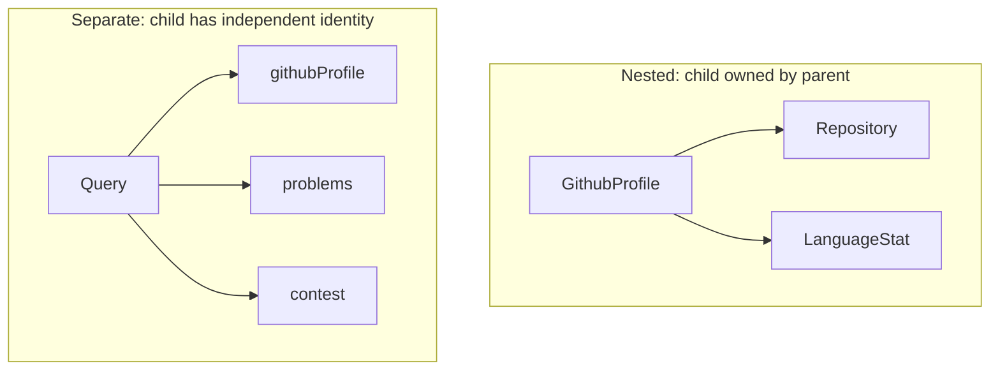
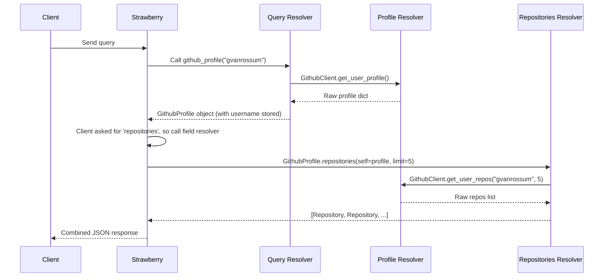

# 03 - Schema Design

Schema design is API design. Every decision you make in your GraphQL schema is a decision about what your frontend can ask for and how. Get it right and your schema lasts years. Get it wrong and you are making breaking changes constantly.

This document covers the decisions made in Phase 2 and why.

---

## What Schema Design Actually Means

SDL (the Schema Definition Language) is just the syntax for writing down decisions you already made. The hard part is making those decisions in the first place.

The questions schema design answers:

- Which types should be nested inside other types, and which should be separate root queries?
- When should a field be nullable vs non-nullable?
- Which fields should accept arguments?
- How granular should your types be?

There are no universal right answers. But there are principles that help.

---

## Type Composition: Nested vs Separate

In Phase 2, repositories live inside GithubProfile:

```graphql
type GithubProfile {
  username: String!
  repositories(limit: Int = 10): [Repository!]!
}
```

You could instead have made `repositories` a root query:

```graphql
type Query {
  githubProfile(username: String!): GithubProfile
  repositories(username: String!): [Repository!]!   # alternative
}
```

How do you choose?

**Nest it when:** the child cannot exist independently from the parent. A repository without a profile owner is meaningless in this context. The client always needs the profile first. Nesting makes the ownership relationship visible in the schema itself.

**Separate it when:** the child is independently useful. LeetCode problems are not "owned" by a profile in the same way. You might want to query problems by difficulty, by topic, or by contest — not always through a developer profile.



---

## Field Arguments

Arguments make fields flexible without adding new types.

```graphql
repositories(
  limit: Int = 10
  includeForks: Boolean = false
): [Repository!]!
```

A client that wants 5 repos sends:
```graphql
{ githubProfile(username: "torvalds") { repositories(limit: 5) { name } } }
```

A client that wants the default 10 sends:
```graphql
{ githubProfile(username: "torvalds") { repositories { name } } }
```

Same field, different behavior. No new resolver needed.

**When to add arguments:**
- Pagination controls (limit, offset, cursor)
- Filtering (includeForks, language, minStars)
- Sorting (orderBy)

**When not to add arguments:**
- When you need to filter by many combinations → use a filter input type instead
- When the argument changes the return TYPE, not just the data → that might need a separate field

---

## Nullable vs Non-Nullable

This is the most common mistake in schema design. The rule is simple but requires judgment.

```graphql
username: String!    # Non-nullable: this developer ALWAYS has a username
name: String         # Nullable: GitHub allows users with no display name
bio: String          # Nullable: bio is optional
avatarUrl: String!   # Non-nullable: GitHub always provides an avatar
```

Ask this question for every field:

> "Can a valid, correctly-fetched object have this field as null — not due to an error, but legitimately?"

If yes: nullable. If no: non-nullable.

**A practical rule:** be more willing to make fields nullable when:
- The data comes from an external API you don't control
- The field is enriched or optional user input
- You are not sure yet (you can make a nullable field non-nullable later — it is a non-breaking change)

Making a non-nullable field nullable later IS a breaking change (clients may not be handling null). Making a nullable field non-nullable is safe.

---

## The N+1 Problem (Preview)

You need to understand this before Phase 8 where DataLoader fixes it.

Look at this query:

```graphql
{
  developers {
    username
    repositories(limit: 3) { name }
  }
}
```

Here is what happens if you have 20 developers:

```
1 query  → fetch all 20 developers
20 queries → fetch repos for developer 1
             fetch repos for developer 2
             ...
             fetch repos for developer 20
= 21 total GitHub API calls
```

This is called the N+1 problem. 1 root query + N child queries for N results.

For Phase 2, this is not a problem because you are querying one developer at a time. Once Phase 6 (Federation) lets you query all developers across services, the N+1 problem appears. DataLoader (Phase 8) batches those N queries into 1.

Understanding this now means you will recognize it immediately when you hit it.

---

## How Nested Resolvers Work Internally

When a client sends this:

```graphql
{
  githubProfile(username: "gvanrossum") {
    name
    followers
    repositories(limit: 5) {
      name
      stars
    }
  }
}
```

Strawberry executes in this order:



The `name` and `followers` fields required no extra resolvers — Strawberry read them directly off the `GithubProfile` object the root resolver returned.

---

## Interview Questions for Phase 2

**Q: What is the difference between a root resolver and a nested resolver?**

Strong answer: A root resolver is attached to the Query type — it starts a query chain. A nested resolver is attached to a specific type, like GithubProfile. It only runs when the client requests that field on an instance of that type. In Strawberry you define nested resolvers as `@strawberry.field` methods on the type class itself, where `self` gives you access to the parent object's data.

**Q: What is the N+1 problem in GraphQL?**

Strong answer: When you resolve a list of N objects and each object has a nested field that triggers its own resolver, you get N+1 database or API calls — one for the list and one per item. For example, 20 developers each resolving their repositories triggers 21 calls. DataLoader solves this by batching all N lookups into a single call.

**Q: How do you pass dependencies (like a database session) into a resolver?**

Strong answer: Through the context. In Strawberry with FastAPI, you define a `context_getter` function that runs per request. It returns a dict that becomes `info.context` in every resolver. This keeps resolvers testable: in tests you inject a dict with a mock service instead of a real one.

**Q: When would you make a field nullable vs non-nullable?**

Strong answer: A field is non-nullable if a valid object can never legitimately have it missing — not due to an error, but by definition. Username is non-nullable because every GitHub user has one. Bio is nullable because users may not write one. The practical rule: when in doubt, start nullable — you can make a nullable field non-nullable later without breaking clients, but not the reverse.

---

## What You Learned

- Type composition: when to nest types vs make them separate root queries
- Field arguments: how to make fields flexible without adding new resolvers
- Nullable design decisions and how to reason about them
- The N+1 problem at the conceptual level
- How nested resolvers are triggered lazily by client field selection

## Exercises

1. Add a `starred_repos(language: String): [Repository!]!` field to `GithubProfile` that filters by language. You will need to add a method to `GithubService` and a `@strawberry.field` method to `GithubProfile`.

2. Add a `total_stars: Int!` field to `GithubProfile` that computes the total stars across all public repos. This is a computed field — it requires no new API call if you already fetched the repos.

3. What happens if you query `githubProfile(username: "this-user-does-not-exist")`? Test it in GraphiQL. The resolver returns `None` which becomes `null` in JSON. How would you instead return an error? Look at Strawberry's error handling: https://strawberry.rocks/docs/types/error-types

4. In the GraphiQL Docs panel, find `GithubProfile`. Notice that `repositories` shows its arguments. Try calling it with different `limit` values and observe the server terminal to see how many API calls each query triggers.

## Further Reading

- GraphQL schema design principles: https://graphql.org/learn/schema
- Strawberry field descriptions: https://strawberry.rocks/docs/types/object-types
- N+1 problem explained: https://shopify.engineering/solving-the-n-1-problem-for-graphql-through-batching
