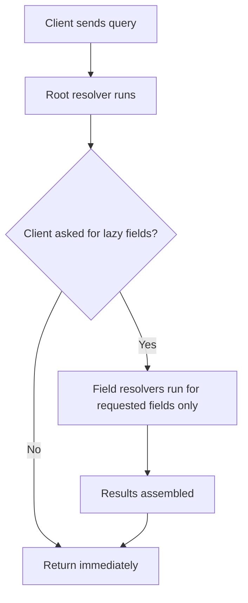

# 04 - Resolvers, Enums, and Pagination

Phase 3 introduced three things. This document explains each one properly so you can talk about them in interviews.

---

## Resolvers: The Complete Picture

You have now seen three kinds of resolvers across Phase 1, 2, and 3. It is worth naming them clearly.

### 1. Root Resolvers

Attached to the `Query` type. Every GraphQL query starts here.

```python
@strawberry.type
class Query:
    @strawberry.field
    async def leetcode_profile(self, username: str, info: Info) -> Optional[LeetCodeProfile]:
        ...
```

The client calls: `{ leetcodeProfile(username: "sumit") { ... } }`

### 2. Field Resolvers (Lazy)

Attached to a specific type as a method. Only run when the client requests that field.

```python
@strawberry.type
class LeetCodeProfile:
    @strawberry.field
    async def contest_info(self, info: Info) -> Optional[ContestInfo]:
        ...
```

The client calls: `{ leetcodeProfile { contestInfo { rating } } }`
If the client omits `contestInfo`, this method never runs.

### 3. Computed Field Resolvers (No I/O)

Also attached to a type, but require no database or API call.
They compute a value from data already on the object.

```python
@strawberry.type
class ProblemStats:
    total_solved: int
    hard_solved: int

    @strawberry.field
    def hard_percentage(self) -> float:
        if self.total_solved == 0:
            return 0.0
        return round((self.hard_solved / self.total_solved) * 100, 1)
```

`self.total_solved` is already on the object. No API call needed.
These are essentially computed properties exposed through GraphQL.

### Execution Order



---

## Enum Types

An enum is a field whose valid values are defined upfront in the schema.

```graphql
enum Difficulty {
  EASY
  MEDIUM
  HARD
}
```

Once this enum exists in the schema, GraphQL enforces it at the boundary.
If a client sends `solvedFor(difficulty: IMPOSSIBLE)`, the request is
rejected before any Python code runs. You do not need to validate this
yourself in your resolver or service.

### In Strawberry

```python
import enum
import strawberry

@strawberry.enum
class Difficulty(enum.Enum):
    EASY = "Easy"      # Python value = "Easy" (what LeetCode returns)
    MEDIUM = "Medium"  # GraphQL name = MEDIUM (what clients send)
    HARD = "Hard"
```

Two values per member:
- The Python value (`"Easy"`) is what your Python code works with internally.
- The GraphQL name (`EASY`) is what clients write in their queries.

### Enums as Field Arguments

```python
@strawberry.field
def solved_for(self, difficulty: Difficulty) -> int:
    mapping = {
        Difficulty.EASY: self.easy_solved,
        Difficulty.MEDIUM: self.medium_solved,
        Difficulty.HARD: self.hard_solved,
    }
    return mapping[difficulty]
```

Client call: `problemStats { solvedFor(difficulty: HARD) }`

The `difficulty` parameter arrives as a Python `Difficulty` enum member,
not as the string "HARD". Strawberry handles the conversion.

### When to Use Enums

Use an enum when a field or argument has a fixed, known set of valid values.

Good candidates: difficulty levels, status codes, sort directions, role types, environment names.

Bad candidates: free-text fields, usernames, categories that grow over time (adding a new enum value is a schema change and requires coordination with clients).

---

## Pagination

Phase 3 uses the simplest form: **limit-based pagination**.

```graphql
recentSubmissions(limit: Int = 10): [Submission!]!
```

The client specifies how many results it wants. Default is 10.

```graphql
{ leetcodeProfile(username: "sumit") {
    recentSubmissions(limit: 5) { title }
}}
```

### When Limit-Based Is Enough

Limit-based pagination is appropriate when:
- The dataset is small (submissions list tops out at 20 for LeetCode's API)
- Clients don't need to navigate pages ("give me page 3")
- No need to resume where you left off ("continue from item 47")

### What Offset Pagination Adds

```graphql
recentSubmissions(limit: 10, offset: 20): [Submission!]!
```

Offset lets the client skip items: offset=20 means "skip the first 20, give me the next 10".
Useful for "page 3 of results".

Problem: if new items are added while you are paginating, offsets shift.
Page 3 might return items you already saw on page 2.

### Cursor Pagination (Phase 8)

The production-quality approach. Instead of a number, each page gives you
a cursor (an opaque string, usually a base64-encoded ID or timestamp).
The next request passes this cursor to get the next page.

```graphql
recentSubmissions(first: 10, after: "cursor-from-previous-response"): SubmissionConnection!
```

Cursor pagination is stable: new items don't shift your position.
This is the approach used by GitHub, Facebook, and most large GraphQL APIs.
Phase 8 implements it.

---

## GraphQL Calling GraphQL

Phase 3 is the first time your service calls another service's GraphQL API.

Your LeetCode client sends:
```python
await client.post(
    "https://leetcode.com/graphql",
    json={
        "query": "query userPublicProfile($username: String!) { ... }",
        "variables": {"username": username}
    }
)
```

This is just an HTTP POST with a JSON body. The fact that the body contains
a GraphQL query is invisible to httpx. The GraphQL protocol is just JSON over HTTP.

This matters when thinking about Federation (Phase 6): the Apollo Gateway
also calls your subgraph services over HTTP, sending GraphQL queries
and assembling the responses. The same mechanism, at a larger scale.

---

## Interview Questions for Phase 3

**Q: What is the difference between an embedded type and a field resolver in GraphQL?**

Strong answer: An embedded type is data that is created and attached directly by the parent resolver — no extra API call required. A field resolver is a method on a type that only runs if the client requests that field, allowing lazy loading of data that requires a separate source. In the LeetCode service, ProblemStats is embedded because it comes from the same API response as the profile. ContestInfo is a field resolver because it requires a separate API call to LeetCode and many users never enter contests.

**Q: What are GraphQL enums and why are they better than plain strings for finite sets of values?**

Strong answer: Enums define a closed set of valid values in the schema itself. If a client sends an invalid value as an enum argument, GraphQL rejects the request during schema validation before any resolver code runs. With plain strings, you have to validate in your resolver or service. Enums also improve tooling: clients get autocomplete and type-safe code generation because the valid values are part of the schema contract.

**Q: What are the tradeoffs between limit-based and cursor-based pagination?**

Strong answer: Limit-based pagination is simple to implement and understand, but suffers from drift — if new items are inserted while a client is paginating, the offset shifts and items can be duplicated or skipped. Cursor-based pagination is stable because each page gives you an opaque cursor pointing to a specific position in the data. The next request resumes from exactly that position, unaffected by inserts. The tradeoff is complexity: cursors require encoding position information and the schema becomes more verbose (Connection types, edges, pageInfo). For small or static datasets, limit-based is fine. For any production feed or list that updates frequently, cursor-based is the right choice.

---

## What You Learned

- The three kinds of resolvers: root, field (lazy), and computed
- How enums enforce valid values at the schema boundary
- The difference between embedded types and field resolvers
- Limit-based vs cursor-based pagination and when to use each
- That GraphQL over HTTP is just POST with a JSON body (useful for understanding Federation)

## Exercises

1. Add a `DifficultyBreakdown` type with `difficulty: Difficulty!` and `solved: Int!` fields. Add a `byDifficulty: [DifficultyBreakdown!]!` field to `ProblemStats` that returns all three difficulties as a list. The client can then do `problemStats { byDifficulty { difficulty solved } }`.

2. Add offset pagination to `recentSubmissions`: `recentSubmissions(limit: Int = 10, offset: Int = 0)`. Note that LeetCode's API doesn't support offset — you would need to fetch more and slice in Python.

3. Try sending an invalid enum value in GraphiQL: `problemStats { solvedFor(difficulty: IMPOSSIBLE) }`. Read the error message. Note that the error comes before any Python code runs.

4. Add a `totalSubmissions: Int!` field to `ProblemStats` that represents the total number of submission attempts (not just accepted ones). Look at the `submissions` field in the `acSubmissionNum` array from LeetCode.

## Further Reading

- GraphQL enums: https://graphql.org/learn/schema/#enumeration-types
- Pagination in GraphQL: https://graphql.org/learn/pagination
- Relay cursor spec: https://relay.dev/graphql/connections.htm
